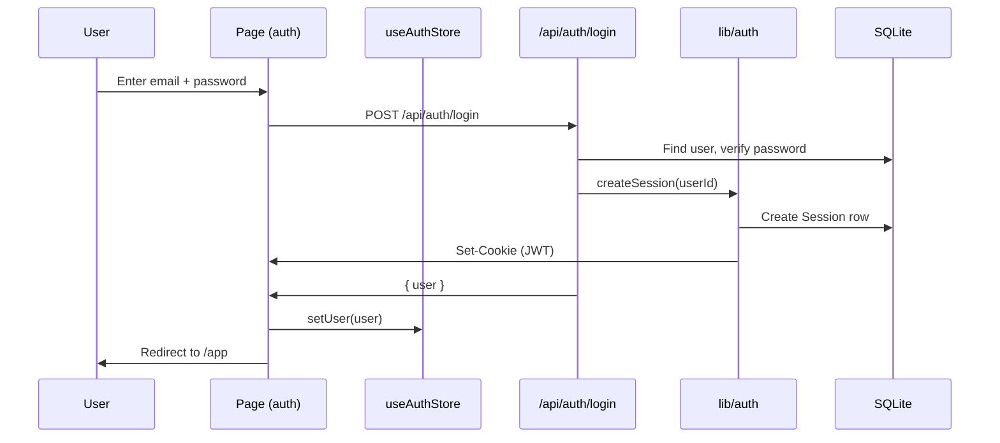
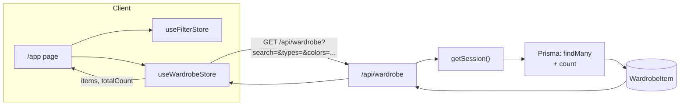
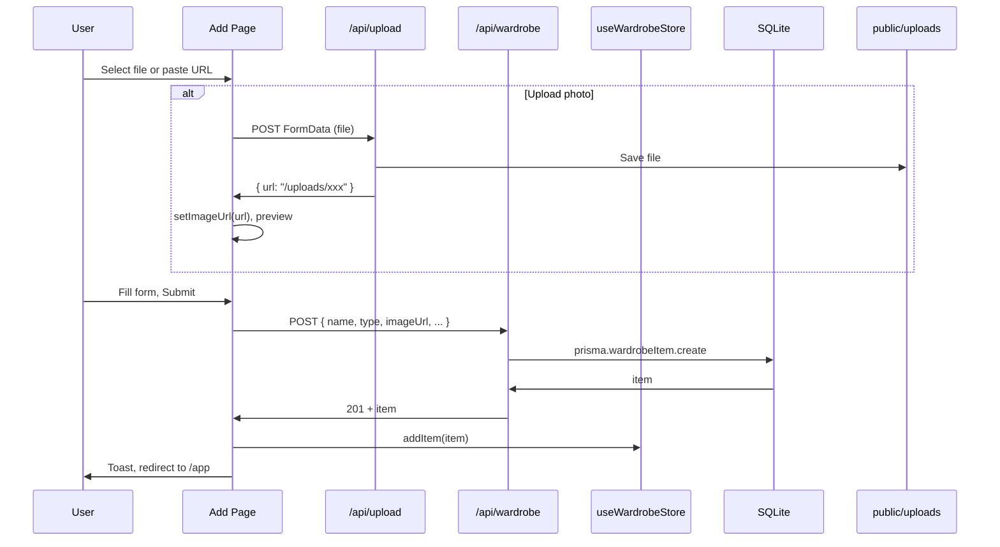
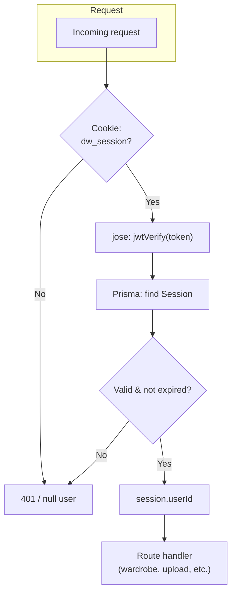
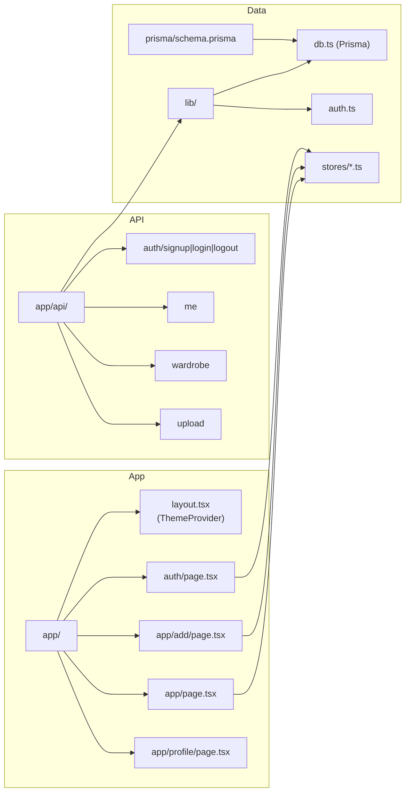

# Digital Wardrobe — Data Flow Diagram

## High-level data flow

flowchart TB
    subgraph Client["Browser / Client"]
        Pages["Pages\n(/, /auth, /app, /app/add, /app/profile)"]
        UI["UI Components\n(Button, Card, Sheet, etc.)"]
        Pages --> UI
    end

    subgraph State["Zustand Stores"]
        Auth["useAuthStore\n(user, login/logout)"]
        Wardrobe["useWardrobeStore\n(items, selectedItem, sheet)"]
        Filters["useFilterStore\n(search, types, colors, etc.)"]
        Toast["useToastStore\n(toasts)"]
    end

    subgraph API["Next.js API Routes"]
        AuthAPI["/api/auth/*\n(signup, login, logout)"]
        Me["/api/me"]
        WardrobeAPI["/api/wardrobe\n(GET list, POST create)"]
        WardrobeId["/api/wardrobe/[id]\n(GET, DELETE)"]
        Upload["/api/upload\n(POST file)"]
    end

    subgraph Backend["Backend"]
        AuthLib["lib/auth\n(session, JWT, cookies)"]
        Prisma["Prisma Client"]
        DB[(SQLite\nUser, Session,\nWardrobeItem)]
        FS["public/uploads/"]
    end

    subgraph External["External"]
        Pexels["Pexels API\n(seed images only)"]
    end

    Pages --> Auth
    Pages --> Wardrobe
    Pages --> Filters
    Pages --> Toast
    UI --> State

    State -->|fetch| API
    API --> AuthLib
    API --> Prisma
    AuthLib --> Prisma
    Prisma --> DB
    Upload -->|writes| FS["public/uploads/"]
    Prisma -->|seed script| Pexels
```

## Auth flow



## Wardrobe list & filters flow



## Add item (with upload) flow



## Session & protected routes



## File structure (data-related)



---

*View these diagrams in any Mermaid-compatible viewer (e.g. [Mermaid Live](https://mermaid.live), GitHub, or VS Code with a Mermaid extension).*
